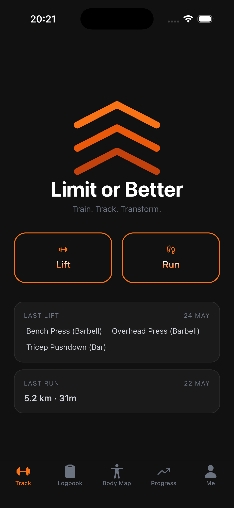
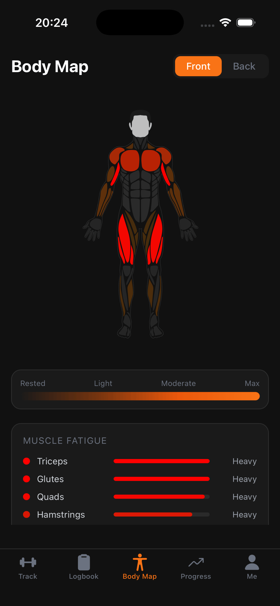
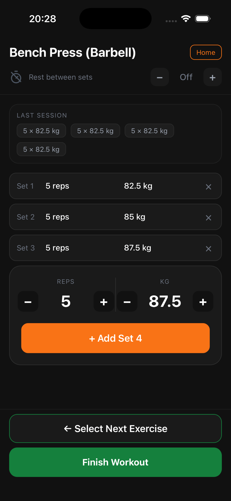
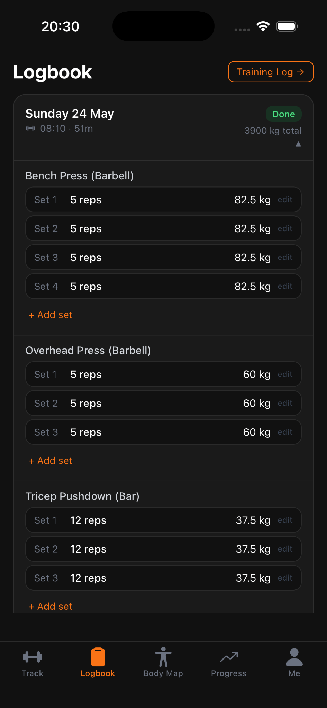
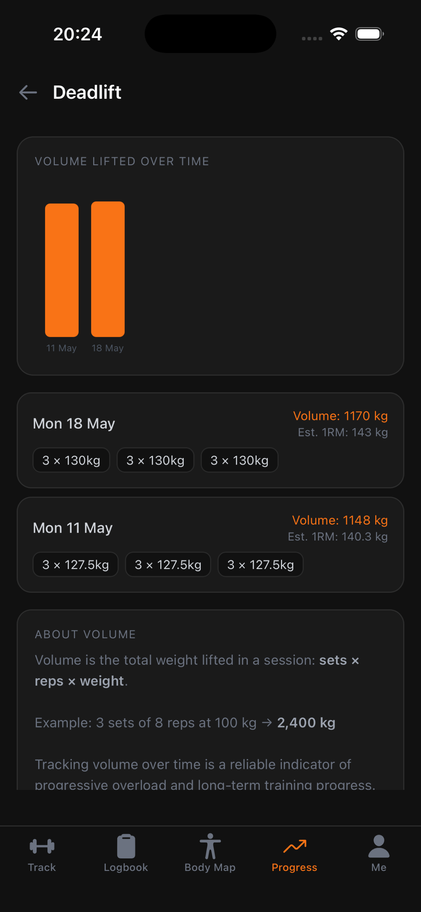

# Limit or Better

**Train. Track. Transform.**

A no-nonsense training app for people who lift, run, or both. Log sets, track runs, watch your body recover — all on your device, no account required.

 

<table>
  <tr>
    <td></td>
    <td></td>
    <td></td>
    <td></td>
    <td></td>
  </tr>
</table>

 

## Features

- **Lift tracking** — log sets, reps, and weight with your last session shown so you always know what to beat
- **Run tracking** — GPS or manual, with pace, personal bests, and all-time totals
- **Body fatigue map** — EMG-researched muscle model shows exactly what's recovered and what isn't
- **Progress charts** — volume over time per exercise with estimated 1RM
- **Templates** — save your Push/Pull/Leg days and start a session in one tap
- **100+ exercises** — organised by muscle group, or add your own
- **Private by design** — everything stays on your device, no account, no cloud, no tracking

## Download

Available on the [App Store](https://apps.apple.com/app/limit-or-better/id6769979215).

## Support & Privacy

[limitorbetter.github.io](https://limitorbetter.github.io)
